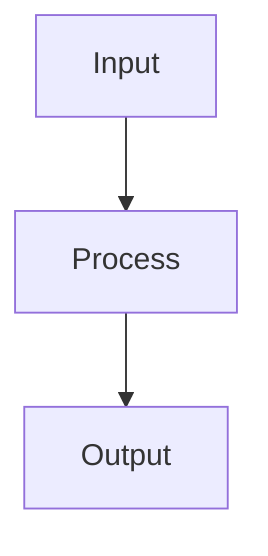

# Geulte

[English](./README.en.md) | [한국어](./README.md)

> An open-source framework that transforms Obsidian-style markdown vaults into taxonomy-based static blogs.

[](https://www.npmjs.com/package/geulte)
[](LICENSE)

Changelog: [docs/CHANGELOG.md](./docs/CHANGELOG.md)

---

## Features

- **Obsidian Compatibility**: Full support for `[[wikilinks]]`, callouts, footnotes, and backlinks.
- **Multiple Taxonomies**: Independent use of tags, topics, keywords, categories, and series.
- **Combination Filter**: Dynamically filter by combining tags, topics, and categories on the `/posts` list (powered by Vercel Serverless Functions).
- **Series Navigation**: Grouped posts (series) feature with automatic prev/next links and progress indicators.
- **Client-Side Search**: ⌘K shortcut, keyboard navigation, and real-time highlight search (powered by MiniSearch).
- **Tag Cloud Widget**: 4-tier normalized font sizes and color densities based on tag frequency, with persistent collapsible state support.
- **Recent / Popular Posts Widget**: Tabbed right-sidebar widget displaying latest posts by date and most-referenced posts by backlink count (or views).
- **TOC Scrollspy**: Viewport heading tracking, smooth anchor scrolling, and a sticky mobile mini-TOC bar.
- **3-Tier Responsive Layout**: Desktop (3 columns), tablet (2 columns), and mobile (1 column off-canvas drawer) with sticky Footer and TOC optimization.
- **Infinite Scroll (Lazy Loading)**: Initial SSR rendering of 10 posts on the home page followed by chunked dynamic loading on scroll.
- **Dark / Light Mode Toggle**: Header one-click toggle, `localStorage` persistence, and real-time OS `prefers-color-scheme` synchronization.
- **Backlink & Popover UI**: Backlinks displayed on the right sidebar, featuring an Obsidian-style popover preview on mouse hover.
- **Related Posts**: Automatic recommendation of posts with overlapping tags or categories.
- **i18n & Localization**: Multi-language routing (e.g. `/en/`), language switcher, SEO `hreflang` tags, and custom translation templates.
- **Auto OG Image Generation**: Generates Open Graph images per post at build time with satori (requires `public/fonts/NotoSansKR-Bold.ttf` in the package or site; skips generation if missing).
- **Automated RSS Feeds**: Automatically renders main `rss.xml` and category-specific RSS feeds.
- **SEO basics**: canonical links, `sitemap.xml`, `robots.txt`, Open Graph, Twitter Card, BlogPosting JSON-LD
- **Code highlighting & copy**: Shiki (github-light/dark) plus a code-block copy button
- **Dev live reload**: `geulte dev` auto-refreshes the browser after rebuilds (SSE)
- **Static pages**: `content/pages/` → `/{slug}/` (excluded from lists/RSS)
- **Optional image optimization**: `build.images.enabled` for sharp WebP/AVIF srcset
- **Plugin hooks**: `geulte.config.mjs` — `onConfig` / `afterScan` / `afterGenerate`
- **View Count & Dashboard**: Real-time view count tracking (via Supabase RPC) and an integrated backoffice dashboard (`/dashboard`) for statistics.
- **Giscus Comments Sync**: Built-in Github Discussions widget with real-time light/dark theme synchronization.
- **Math & Diagrams**: Built-in support for KaTeX math and Mermaid diagrams.
- **Hybrid Rendering**: Static site generation (SSG) for content, combined with real-time Supabase queries for search filters, view counts, and backlinks.
- **Vercel + GitHub Actions**: 1-click automatic deployment setup.

---

## Quick Start

```bash
# 1. Scaffold a new project
npx geulte init my-blog
cd my-blog

# 2. Install dependencies
npm install

# 3. Run development server
npm run dev
# → http://localhost:3000

# 4. Build for production (includes Supabase sync)
npm run build
```

---

## Markdown Features

### Wikilinks

```markdown
[[Other Post Title]]           # Internal link
[[Other Post Title|Alias]]     # Alias support
```

### Callouts

```markdown
> [!NOTE]
> This is a note.

> [!WARNING]
> This requires attention.
```

Supported types: `NOTE`, `WARNING`, `TIP`, `IMPORTANT`, `CAUTION`, `INFO`, `SUCCESS`, `DANGER`

### Math (KaTeX)

```markdown
Inline: $E = mc^2$

Block:
$$
\int_{-\infty}^{\infty} e^{-x^2} dx = \sqrt{\pi}
$$
```

### Mermaid Diagrams

````markdown

````

---

## Frontmatter Schema

All fields are optional.

```yaml
---
title: "Post Title"              # Auto-generated from filename if omitted
date: 2026-09-05                 # Falls back to file modification time
updated: 2026-09-06              # Optional
tags: ["AI", "LLM"]              # Optional, string or array
topics: ["Ontology"]             # Optional
keywords: ["RAG", "Embedding"]   # Optional
category: "Tech"                 # Optional, single string
type: "tutorial"                 # Optional: note|tutorial|review|log
series: "Local LLM Series"       # Optional, series name
lang: "en"                       # Optional: target language (defaults to config)
description: "SEO summary"       # Optional (falls back to excerpt)
cover: "/assets/cover.jpg"       # Optional OG/Twitter image (`image` synonym)
draft: false                     # Excludes from build if true
---
```

Static pages live in `content/pages/*.md` → `/{slug}/` (excluded from post lists and RSS).

---

## CLI Commands

```bash
geulte init <project-name>   # Scaffold new project
geulte dev [-p 3000]         # Dev server with watch + live reload
geulte build [--no-sync]     # Build and sync with Supabase
geulte sync                  # Sync with Supabase without building
```

---

## config.yaml Reference

```yaml
site:
  title: "My Blog"
  url: "https://myblog.com"         # Required, absolute URL
  description: "Blog Description"
  author: "Author Name"

taxonomy:
  tags:
    label: "Tags"
    slug: "/tags"
  topics:
    label: "Topics"
    slug: "/topics"
  keywords:
    label: "Keywords"
    slug: "/keywords"
  category:
    label: "Categories"
    slug: "/categories"

theme:
  darkMode: true
  sidebar: "left"
  toc: "right"
  accentColor: "#58a6ff"
  tagCloud:
    position: "sidebar"
    maxItems: 50
  recentPosts:
    count: 5
  popularPosts:
    metric: "backlinks"
    count: 5

comments:
  provider: "giscus"
  giscus:
    repo: "username/repo"
    repoId: "R_kgDOXXXXXX"
    category: "Announcements"
    categoryId: "DIC_kwDOXXXXXX"
    mapping: "pathname"

i18n:
  defaultLocale: "ko"
  locales:
    - code: "ko"
      label: "한국어"
    - code: "en"
      label: "English"

database:
  provider: "supabase"
  url: "env:SUPABASE_URL"
  key: "env:SUPABASE_KEY"

build:
  output: "dist"
  incremental: false                # reserved; not implemented yet
  images:
    enabled: false                  # sharp WebP/AVIF srcset when true
    widths: [640, 1280]
    format: "webp"                  # webp | avif
```

---

## Plugins (`geulte.config.mjs`)

```js
export default {
  plugins: [
    {
      name: 'hello',
      onConfig(config) {
        return config;
      },
      async afterScan({ posts }) {
        console.log('posts', posts.size);
      },
      async afterGenerate({ outDir }) {
        console.log('done', outDir);
      },
    },
  ],
};
```

See [`examples/plugins/`](examples/plugins/).

---

## License

MIT © [s4ngwoo](https://github.com/s4ngwoo)
