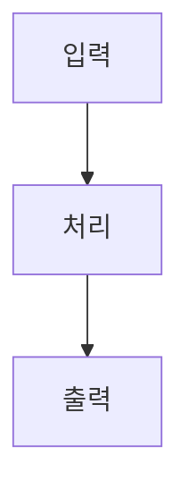

# 글터 (Geulte)

[English](./README.en.md) | [한국어](./README.md)

> Obsidian 스타일 마크다운 볼트를 다중 분류(taxonomy) 기반 정적 블로그로 변환하는 오픈소스 프레임워크

[](https://www.npmjs.com/package/geulte)
[](LICENSE)

변경 이력: [docs/CHANGELOG.md](./docs/CHANGELOG.md)

---

## 특징

- **Obsidian 호환**: `[[wikilinks]]`, callouts, 각주, 백링크 완전 지원
- **다중 분류(taxonomy)**: 태그, 토픽, 키워드, 카테고리, 시리즈를 독립적으로 사용
- **조합 필터**: `/posts`에서 태그·토픽·키워드·카테고리·시리즈 다중 조합. `geulte dev`의 로컬 `/api/filter` 또는 Vercel Serverless `api/filter`(+ Supabase)로 동작 — `database.url` 설정 여부와 무관하게 패널이 켜짐
- **시리즈 네비게이션**: 묶음 글(시리즈) 기능, 자동 이전/다음 글 링크 및 진행률 지원
- **클라이언트 검색**: ⌘K 단축키, 방향키 지원, 실시간 하이라이트 검색 (MiniSearch 기반)
- **태그 클라우드 위젯**: 빈도수 기반 4단계 정규화(Tier 1~4) 크기/농도 지원, 접기/펼치기 및 영속화 지원
- **최신글 / 인기글 탭 위젯**: 우측 사이드바에 날짜 기준 최신글 및 백링크 언급 수(또는 조회수) 기준 인기글 탭 UI 제공
- **TOC 스크롤 연동 (Scrollspy)**: 뷰포트 헤더 감지, 부드러운 스크롤 이동 및 모바일용 상단 스티키(Sticky) 미니 목차 바 지원
- **반응형 3단 레이아웃**: 데스크탑(3컬럼), 태블릿(2컬럼), 모바일(1컬럼 오프캔버스 드로어). Footer 및 TOC 뷰포트 고정 최적화
- **무한 스크롤 (Lazy Loading)**: 메인 페이지 초기 10개 SSR 렌더링 후 스크롤 시 포스트 청크 단위 동적 로드
- **다크 / 라이트 모드 토글**: 헤더 원클릭 전환, `localStorage` 영속화 및 시스템 테마(`prefers-color-scheme`) 실시간 반응
- **백링크 & 팝오버 UI**: 우측 사이드바에 백링크 노출, 마우스 오버 시 Obsidian 스타일의 백링크 본문 미리보기 지원
- **연관 글 추천**: 현재 글과 속성이 겹치는 글을 자동으로 찾아 추천
- **다국어 (i18n) 지원**: 로케일별 경로(`/en/`) 생성, 언어 스위처, `hreflang` SEO 최적화 및 커스텀 번역 템플릿 지원
- **Open Graph 이미지 자동 생성**: 빌드 타임에 satori 기반으로 포스트별 OG 이미지를 자동 생성하여 메타 태그 주입 (패키지 `public/fonts/NotoSansKR-Bold.ttf` 또는 사이트 `public/fonts/`에 동일 폰트 필요. 없으면 생성 건너뜀)
- **RSS 피드 자동 생성**: 사이트 전체 및 카테고리별 분리된 `rss.xml` 자동 렌더링 지원
- **SEO 기본 세트**: canonical, `sitemap.xml`, `robots.txt`, Open Graph, Twitter Card, BlogPosting JSON-LD
- **코드 강조 & 복사**: Shiki(github-light/dark) + 코드 블록 복사 버튼
- **개발 라이브 리로드**: `geulte dev`에서 파일 변경 후 브라우저 자동 새로고침 (SSE)
- **고정 페이지**: `content/pages/` → `/{slug}/` (목록·RSS 비포함)
- **이미지 최적화 (선택)**: `build.images.enabled` 시 sharp WebP/AVIF srcset
- **플러그인 훅**: `geulte.config.mjs` — 현재 `onConfig` / `afterScan` / `afterGenerate`만 지원 (`beforeParse` 등은 미구현)
- **조회수 및 대시보드**: Supabase 연동을 통한 실시간 조회수 트래킹 및 통계용 백오피스 대시보드(`/dashboard`) 제공
- **Giscus 댓글 동기화**: Github Discussions 기반 댓글 위젯 기본 내장 및 라이트/다크 테마 실시간 동기화
- **수식 & 다이어그램**: KaTeX 수식, Mermaid 다이어그램 내장
- **하이브리드 렌더링**: 본문은 정적 생성(SSG), 검색 필터/조회수/백링크는 Supabase 기반의 실시간 쿼리 결합
- **Vercel + GitHub Actions**: 1-click 배포 설정 자동 생성

---

## 빠른 시작

```bash
# 1. 새 프로젝트 생성
npx geulte init my-blog
cd my-blog

# 2. 의존성 설치
npm install

# 3. 개발 서버 실행
npm run dev
# → http://localhost:3000
# 스캐폴드에 content/pages/about.md 예시와 api/filter.js가 포함됩니다.

# 4. 배포 빌드 (Supabase 동기화 포함)
npm run build
```

---

## 마크다운 기능

### Wikilinks

```markdown
[[다른 글 제목]]           # 내부 링크
[[다른 글 제목|표시 텍스트]] # 별명 지원
```

### Callouts

```markdown
> [!NOTE]
> 참고 사항입니다.

> [!WARNING]
> 주의가 필요합니다.

> [!TIP]
> 유용한 팁입니다.

> [!DANGER]
> 위험한 내용입니다.
```

지원 타입: `NOTE`, `WARNING`, `TIP`, `IMPORTANT`, `CAUTION`, `INFO`, `SUCCESS`, `DANGER`

### 수식 (KaTeX)

```markdown
인라인: $E = mc^2$

블록:
$$
\int_{-\infty}^{\infty} e^{-x^2} dx = \sqrt{\pi}
$$
```

### Mermaid 다이어그램

````markdown

````

---

## Frontmatter 스키마

모든 필드는 선택적(optional)입니다. 없어도 빌드가 깨지지 않습니다.

```yaml
---
title: "글 제목"              # 없으면 파일명에서 자동 생성
date: 2026-09-05             # 없으면 파일 수정 시간 사용
updated: 2026-09-06          # 선택
tags: ["AI", "LLM"]          # 선택, 문자열 또는 배열
topics: ["온톨로지"]          # 선택
keywords: ["RAG", "임베딩"]   # 선택
category: "기술"              # 선택, 단일 값
type: "tutorial"             # 선택: note|tutorial|review|log
series: "로컬 LLM 시리즈"    # 선택, 시리즈 이름
lang: "ko"                   # 선택: 언어 지정 (기본값 config 참조)
description: "SEO용 요약"    # 선택 (없으면 excerpt)
cover: "/assets/cover.jpg"   # 선택, OG·Twitter 이미지 (image 동의어)
draft: false                 # true면 빌드에서 제외
---
```

고정 페이지는 `content/pages/*.md` → `/{slug}/` (글 목록·RSS에 포함되지 않음). `geulte init` 스캐폴드는 `content/pages/about.md` 예시를 포함합니다.

---

## CLI 명령어

```bash
geulte init <project-name>   # 새 프로젝트 스캐폴딩
geulte dev [-p 3000]         # 개발 서버 (파일 변경 자동 감지)
geulte build [--no-sync]     # 빌드 + Supabase 동기화
geulte sync                  # 빌드 없이 Supabase만 동기화
```

---

## config.yaml 레퍼런스

```yaml
site:
  title: "내 블로그"
  url: "https://myblog.com"         # 필수, 절대 URL
  description: "블로그 설명"          # 선택
  author: "작성자 이름"               # 선택

taxonomy:
  tags:
    label: "태그"
    slug: "/tags"
  topics:
    label: "주제"
    slug: "/topics"
  keywords:
    label: "키워드"
    slug: "/keywords"
  category:
    label: "카테고리"
    slug: "/categories"

theme:
  darkMode: true                    # 기본 다크모드
  sidebar: "left"                   # left | right | both
  toc: "right"                      # left | right | none
  accentColor: "#58a6ff"            # 선택, CSS 색상값
  tagCloud:
    position: "sidebar"             # sidebar | footer
    maxItems: 50                    # 초과 시 '더 보기' 토글 표시
  recentPosts:
    count: 5                        # 표시할 최신 글 개수
  popularPosts:
    metric: "backlinks"             # backlinks | views
    count: 5                        # 표시할 인기 글 개수

comments:
  provider: "giscus"
  giscus:
    repo: "사용자이름/저장소"
    repoId: "R_kgDOXXXXXX"
    category: "Announcements"
    categoryId: "DIC_kwDOXXXXXX"
    mapping: "pathname"

i18n:
  defaultLocale: "ko"
  locales:
    - code: "ko"
      label: "한국어"
    - code: "en"
      label: "English"

database:
  provider: "supabase"
  url: "env:SUPABASE_URL"           # env: 접두사로 환경변수 참조
  key: "env:SUPABASE_KEY"

build:
  output: "dist"                    # 출력 디렉토리
  incremental: false                # 예약 필드 — 아직 미구현 (무시됨)
  images:
    enabled: false                  # true면 sharp로 WebP/AVIF srcset
    widths: [640, 1280]
    format: "webp"                  # webp | avif
```

---

## 플러그인 (`geulte.config.mjs`)

현재 지원 훅은 **`onConfig` / `afterScan` / `afterGenerate` 세 가지뿐**입니다. (`beforeParse`, `afterParse`, `beforeRender` 등은 아직 없습니다.)

```js
export default {
  plugins: [
    {
      name: 'hello',
      onConfig(config) {
        return config;
      },
      async afterScan({ posts }) {
        console.log('posts', posts.size);
      },
      async afterGenerate({ outDir }) {
        console.log('done', outDir);
      },
    },
  ],
};
```

예제: [`examples/plugins/`](examples/plugins/).

---

## Supabase 설정

### 1. Supabase 프로젝트 생성

[Supabase 대시보드](https://supabase.com)에서 새 프로젝트를 생성합니다.

### 2. 테이블 생성

SQL Editor에서 다음을 실행합니다:

```sql
CREATE TABLE IF NOT EXISTS posts (
  slug TEXT PRIMARY KEY,
  title TEXT NOT NULL,
  date TIMESTAMPTZ NOT NULL,
  updated TIMESTAMPTZ,
  tags TEXT[] DEFAULT '{}',
  topics TEXT[] DEFAULT '{}',
  keywords TEXT[] DEFAULT '{}',
  category TEXT,
  type TEXT,
  series TEXT,
  content_html TEXT,
  draft BOOLEAN DEFAULT false,
  excerpt TEXT,
  view_count INTEGER DEFAULT 0,
  search_vector tsvector GENERATED ALWAYS AS (
    to_tsvector('simple', coalesce(title, '') || ' ' || coalesce(excerpt, ''))
  ) STORED
);

CREATE TABLE IF NOT EXISTS backlinks (
  slug TEXT NOT NULL,
  target_slug TEXT NOT NULL,
  PRIMARY KEY (slug, target_slug)
);

CREATE INDEX IF NOT EXISTS idx_posts_tags ON posts USING GIN (tags);
CREATE INDEX IF NOT EXISTS idx_posts_topics ON posts USING GIN (topics);
CREATE INDEX IF NOT EXISTS idx_posts_keywords ON posts USING GIN (keywords);
CREATE INDEX IF NOT EXISTS idx_posts_search ON posts USING GIN (search_vector);
```

### 3. 환경변수 설정

```bash
# 로컬 개발
export SUPABASE_URL="https://xxxx.supabase.co"
export SUPABASE_KEY="your-anon-key"

# GitHub Actions: Settings → Secrets에 추가
SUPABASE_URL, SUPABASE_KEY
```

---

## Vercel 배포

```bash
# Vercel CLI 설치
npm i -g vercel

# 프로젝트 연결 (최초 1회)
vercel

# 환경변수 설정
vercel env add SUPABASE_URL
vercel env add SUPABASE_KEY
```

GitHub Actions 워크플로우(`.github/workflows/deploy.yml`)가 자동으로 생성됩니다.
`VERCEL_TOKEN`, `VERCEL_ORG_ID`, `VERCEL_PROJECT_ID`를 GitHub Secrets에 추가하면
`main` 브랜치 푸시 시 자동 배포됩니다.

---

## 프로젝트 구조

```
myblog/
├── content/
│   └── posts/
│       ├── assets/         # 이미지 등 첨부 파일
│       └── *.md            # 마크다운 글
├── config.yaml             # 사이트 설정
├── package.json
└── vercel.json
```

---

## 라이선스

MIT © [s4ngwoo](https://github.com/s4ngwoo)
