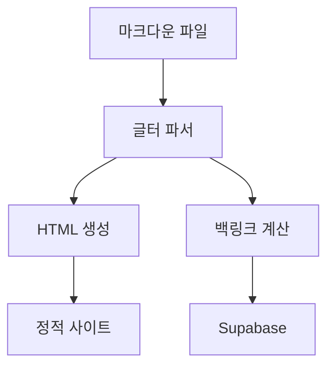

# 마크다운 기능 둘러보기

[[시작하기]] 에서 이어지는 글입니다.

## Callout 종류

> [!INFO]
> 정보성 callout입니다.

> [!WARNING]
> 주의가 필요한 내용입니다.

> [!DANGER]
> 위험한 내용입니다.

> [!SUCCESS]
> 성공적으로 완료되었습니다!

## Mermaid 다이어그램



## 표 (GFM)

| 기능 | 지원 여부 | 비고 |
|---|---|---|
| Wikilinks | ✅ | `[[글 제목]]` |
| Callouts | ✅ | `> [!NOTE]` |
| 수식 (KaTeX) | ✅ | `$...$`, `$$...$$` |
| Mermaid | ✅ | ` ```mermaid` |
| 각주 | ✅ | `[^1]` |

## 각주

각주를 사용할 수 있습니다[^1].

[^1]: 이것이 각주입니다. 본문 하단에 렌더링됩니다.
